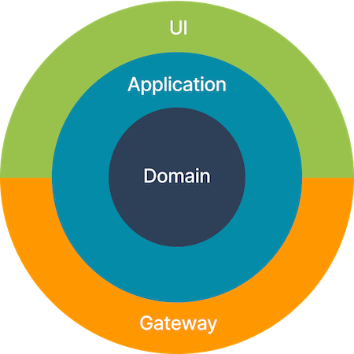
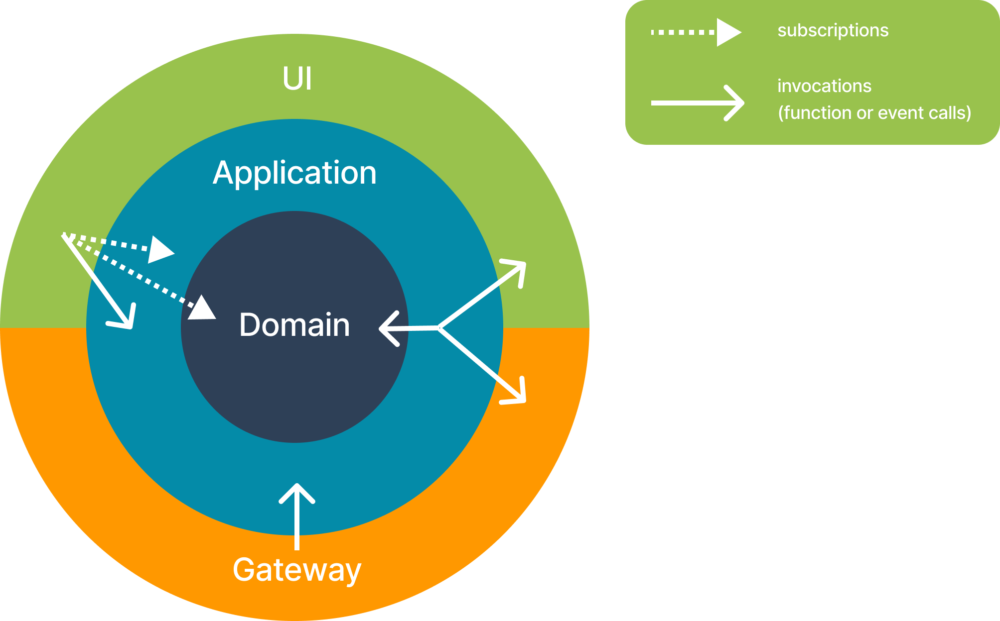

# Mobile app architecture - WIP

## Problems we are trying to solve

- Mixed layers of abstraction. 
in the same event we sometimes process data from UI, perform application logic and send data to the backend.
- Inconsistent re-frame `app-db`. 
UI state, data from backend, and application flow data are mixed, making it hard to track what belongs where.

**Why is this bad?**
Intertwining different levels of abstraction in the same code increases cognitive load for developers and also makes code less testable.

## Layered architecture
Architecture described below was inspired by [clean architecture](https://blog.cleancoder.com/uncle-bob/2012/08/13/the-clean-architecture.html) but does not strictly folow it.
The core idea is to highlight 4 logical layers, each responsible for own set of tasks and to organize the code in a way that each layer is clearly separated.

 


## Layers

### Gateway
`Gateway` is a layer that responsible for communication with "outer" services. 
The main "outer" service that we depend on is `status-go` so most of the code here deals with connections to `status-go`.

> **Reasoning for considering `status-go` an "outer" service?**
> - It’s accessed via remote procedure calls
> - It is a subject to change ()
> - pieces of `status-go` functionality could be theoretically replaced by a another providers which confirms it "outer" nature.

`Gateway` layer abstracts the rest of the application from changes that happen in outer services. 
Which means it:
- hides implementation details of outer services.
- transforms data that arrives from outer services to those used in the app. 

#### Example
Market data is provided by `status-go` via api call to `FetchMarketTokenPageAsync` function. That function **uses pagination** (has `page` and `page-size` arguments). 
After that function called `status-go` starts to regularly emit signals that **in json format** contain information about tokens: their name, price, image, market cap, position in "tokens leaderboard", price change in last 24h, etc.

It is `gateway` layer responsibility to abstract other parts of app of such implementation details as using pagination and using json format. And it is up to gateway to dissect the incoming big ball of data to smaller and more coherent structures to be used in other layers.

Which means `gateway` should:
- maintain the `current-page` variable and increase/reset it as needed to pass to `FetchMarketTokenPageAsync`
- maintain `page-size` variable
- convert incoming structure from json to edn
- split incoming structure to smaller and more coherent ones: token-info, token-price, tokens-leaderboard

### Domain
`Domain` is a layer where business logic lives. It contains the entities of our knowledge domain and operations on them.
For example for `messenger` part of our app such entities are: message, chat, contact, etc. Those are concepts that all messenger apps share.

For `wallet` part of our app domain entities are: accout, token, network, address. All wallets use those because their are part of "crypto" knowledge domain. 

So in the `domain` level of our app we define data structures for such concepts and functions to operate on them.

**What entities belong to `domain`?**

There is a simple question you can ask yourself to check if some data belongs to `domain` layer: "If I will write console version of our application (which means different UI and different user flows), can I reuse the same structures and functions?".
If answer is "yes" - most probably it is a domain-level entities.

#### Example
`network` is a concept from "blockchain" domain. Representations of network can be found in code of any wallet. 

In our code `network` is represented by datastructure with fields:
```clojure
{:testnet?
 :chain-id
 :short-name
 :full-name
 :native-currency-symbol
 ...}
```

And there are functions that work with `network` datastructure
```clojure
(defn ethereum-network?
  [network]
  ...)
  
(defn get-networks-for-layer
  "Returns networks for the layer (`1` or `2`)"
  [networks layer]
  ...)
```

If we will make a console version of the app we can reuse that datastructure and functions which means they  should be stored in `domain` level.

### Application
`Application` is a level that manages **user flows**. It is responsible for coordination between inner `domain` layer and outer layers.
When user interacts with `UI` it is up to the `application` layer to make calls to `domain`, `gateway` or `UI`. 

#### Example
Status mobile app has user flow "Send crypto". 
That flow consists of few screens and on each screen the data required for sending (network, token, amount) is partially filled.

What `application` layer **DOES** in this flow:
- when user goes from step to step in user flow, `application` layer knows what UI should be presented. For example if user starting the `send` flow `application` layer checks if user is already inside a wallet account screen. 
If yes - next screen will be the token selection. If user is not within an account - next screen will be an account selection.
- when user goes through steps in user flow, `application` layer stores intermediate data acquired on steps. When user selected `token` to send `application` layer should remember the selection to use it in the next screen.
- `application` layer knows when to call `domain` to perform checks. If user entered address to send funds to, `application` layer should call the business logic in `domain` layer to check if address is valid. 
If amount of crypto entered - `application` layer redirects to `domain` to check if the amount is less than user owns.
- `application` layer knows when to call `gateway` to communicate with outer services. When user confirms the sending `application` layer should call `gateway` and pass all the collected data to perform sending.

What `application` layer **DOES NOT** in this flow:
- it does not check if address is correct "ethereum" address - it is up to `domain` layer.
- it does not check if user has sufficient amount of crypto to send - it is up to `domain` layer.
- it does not call `status-go` directly - it is up to `gateway` layer. 

### UI
Here belongs everything related to user interface - views, components, styles, animation.
All logic here should be UI-specific and not application-specific.

#### Example
Lets say user is in "enter crypto amount" screen of "send crypto" flow.
That screen has the input field for entering amount of crypto, button for switching between crypto and fiat, button for confirming the amount.

What **ARE** parts of `UI` layer on this screen:
- all the styles, components, animations belong to the `UI` layer
- state of the input field
- state of the fiat/crypto toggle

What **ARE NOT** parts of `UI` layer on this screen:
- logic of converting between fiat and crypto - should be part of the `domain`
- logic of displaying crypto and fiat values (amount of decimals, prepending with fiat symbol) - should be part of the `domain`


## Data management

Each layer has logic and data. This section clarifies which data belons to which layer.

### Gateway data
Here goes data related to the **mechanics** of interaction with outer services: 
- connection states
- timeouts values
- current page in paginated request

If outer service does not respond and we need to make two more tries to reach it before call it "unreachable", the counter of tries should be treated as `gateway` data.

### Domain data
Here goes all the data related to knowledge domain. Distinctive feature of this data is that it is "persistent" which means it stays actual even if we restart the application.
Wallet part of our application works with user profiles, accounts, balances. When we restart the application all of them stay actual. On contrary with user flow data which could be safely discarded when app closed.

If user had 4 accounts in wallet and 10 saved contacts in chat they should stay intact after app reloading. `accounts` and `contacts` are concepts from our knowledge domain, plus they are presistent - that  means it is a `domain` level data.

Note: There are other types of data that should survive data restart. For example user visual settings like light/dark mode.
This data belongs to `UI` layer because it would survive app restart but wouldn't survive rewriting our mobile app to console app. 


### Application data
`Application` layer data contains the state of current "user flow". 
This data can be safely discarded after user has finished the flow.

If user entered some chat we store `current-chat` as piece of `application` data. 
If user is in "send crypto" flow that consist of few consecutive screens, the selections made on all screens (account, token, receiver address) is stored as `application`-layer data.

### UI data
`UI` data contains UI settings or states of the particular screen.

User can switch between fiat and crypto on `enter amount` screen of `send crypto` user flow. But the state of that toggle does not influence any other screens, it is solely UI feature and should be stored under `UI` layer.

### re-frame db organization

Data stored in re-frame db should be normalized, which means:
- each entity is stored only once
- relationships between entities handled using IDs
- redundancy is minimized

`rf-db` keys names should have the structure: `:layer.context/entity`. Where `layer` is a logical layer where data belongs. `context` is an area of application and `entity` is a name of stored data.

Layer names are shortened for convenience `application`->`app`, `gateway`->`gate`.

From previous examples:
- last page fetched from `FetchMarketTokenPageAsync` call to `status-go` can be stored in rf-db under the name `:gate.market/last-fetched-page`.
- token prices extracted from status-go signal payload could be stored under the name `:domain.market/prices` 
- `:app.wallet/send-flow` can contain structure the whole state of the "send-flow" - selected account, selected token, destination address

   
## Communications between layers



- `Domain` layer does not communicate with any other layer and not aware about their existence
- `Application` layer makes calls to `Domain` via events or functions
- `Application` layer makes calls to `UI` via events or functions
- `UI` layer makes calls to `Application` layer via events or functions
- `UI` layer uses subscriptions defined in `Domain` layer
- `UI` layer uses subscriptions defined in `Application` layer
- `UI` layer uses subscriptions defined in `UI` layer


### Subscriptions
Subscriptions can be declared on `Domain`, `Application`, or `UI` level.
- `Domain` layer subscriptions provide access to domain data (most likely without any data transformation)
- `Application` layer subscriptions provide access to state of the current user flows
- `UI` layer subscriptions provide access to ui screen states and also consumes `domain` and `application` layer subscriptions to extract data needed for particular ui elements. 

Subscriptions are named using `:layer.context/entity` pattern.

### Examples:
Domain-level subscriptions to access normalized tokens data:
```clojure
(rf/reg-root-key-sub :domain.market/leaderboard :domain.market/leaderboard)
(rf/reg-root-key-sub :domain.market/prices :domain.market/prices)
(rf/reg-root-key-sub :domain.market/tokens :domain.market/tokens)
```

UI-level subscription that consumes domain data and "massages" it for UI:
```clojure
(rf/reg-sub
 :ui.market/token
 :<- [:domain.market/prices]
 :<- [:domain.market/tokens]
 :<- [:domain.market/leaderboard]
 (fn [[token-prices token-details leaderboard] [_ token-id]]
   (let [{:keys [current-price price-change-percentage-24h market-cap]} (get token-prices token-id)
         {short-name :symbol name :name image :image}                   (get token-details token-id)
         position                                                       (get leaderboard token-id)]
     {:price             (wallet.utils/prettify-balance "$" current-price)
      :percentage-change (utils.number/naive-round price-change-percentage-24h 2)
      :market-cap        (utils.number/format-number-with-si-suffix market-cap)
      :short-name        (when short-name (string/upper-case short-name))
      :token-rank        position
      :token-name        (utils.string/truncate name 18)
      :image             image})))
```


### Events
Events are named using `:layer.context/entity` pattern.

#### Example
```clojure
(rf/reg-event-fx :app.market/close-leaderboard
 (fn [{:keys [_db]}]
   {:fx [[:dispatch [:gate.market/stop-fetching-tokens]]
         [:dispatch [:domain.market/clear-market-data]]]}))
```
  
